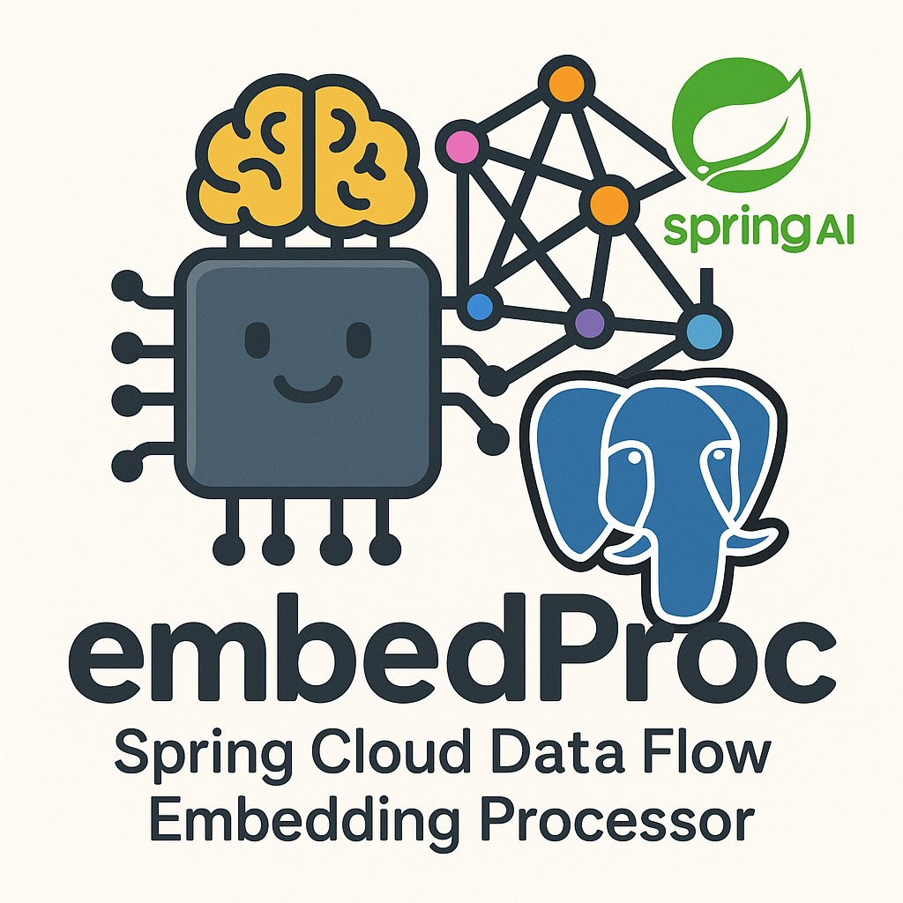

# embedProc: Spring Cloud Data Flow Embedding Processor

## Project Structure & Ignore Rules

This project uses a `.gitignore` file to exclude build artifacts from version control. The `target/` directory, which contains compiled classes and other build outputs, is ignored by default. This helps keep the repository clean and prevents accidental commits of generated files.


This project provides a Spring Cloud Data Flow (SCDF) stream processor that generates embedding vectors for input text using the Ollama Nomic model via Spring AI. It is intended for use in streaming data pipelines where you need to convert text to embeddings for downstream processing.

## Features
- Listens for text messages on an input queue (when the `scdf` profile is active)
- Uses the Ollama Nomic model (or other supported Ollama embedding models) to generate embedding vectors
- Converts the embedding array to a `List<Double>` for compatibility
- Publishes the embedding vector to an output queue

## Required Configuration

You must provide the following configuration values, either in your `application-scdf.properties`, as environment variables, or as command-line arguments:

| Property                              | Example Value                | Required | Purpose                        |
|----------------------------------------|------------------------------|----------|--------------------------------|
| `spring.ai.ollama.embedding.model`     | `nomic-embed-text`           | Yes      | Which embedding model to use   |
| `spring.ai.ollama.base-url`            | `http://localhost:11434`     | If not default | Ollama server location      |
| `spring.profiles.active`               | `scdf`                       | Yes      | Activate SCDF profile          |

### Example `application-scdf.properties`
```properties
spring.ai.ollama.embedding.model=nomic-embed-text
spring.ai.ollama.base-url=http://localhost:11434
spring.profiles.active=scdf
```

### Example Command-Line Launch
```sh
java -jar your-app.jar \
  --spring.profiles.active=scdf \
  --spring.ai.ollama.embedding.model=nomic-embed-text \
  --spring.ai.ollama.base-url=http://localhost:11434
```

### Example Environment Variables
```sh
export SPRING_AI_OLLAMA_EMBEDDING_MODEL=nomic-embed-text
export SPRING_AI_OLLAMA_BASE_URL=http://localhost:11434
```

## Logging
You can increase logging verbosity by setting (in your properties file):
```properties
logging.level.com.example.embeddingprocessor=DEBUG
```

## Additional Notes
- Input and output channel names can be set by SCDF if needed.
- The processor is only active when the `scdf` profile is enabled.

## License
MIT
